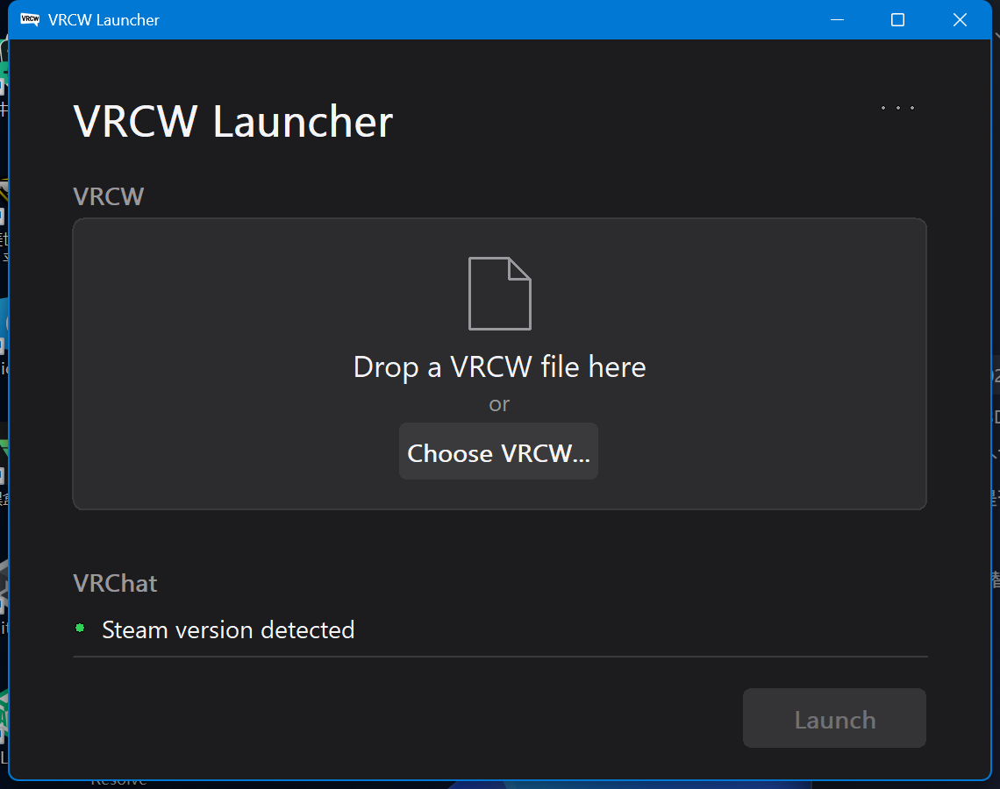
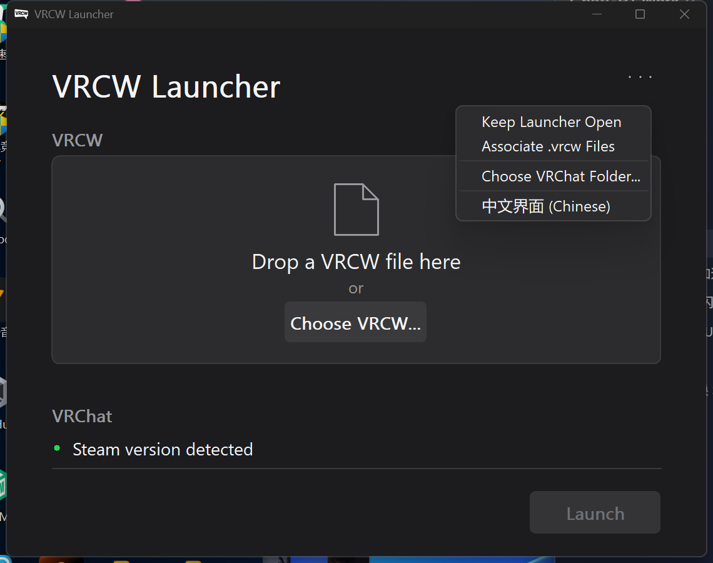
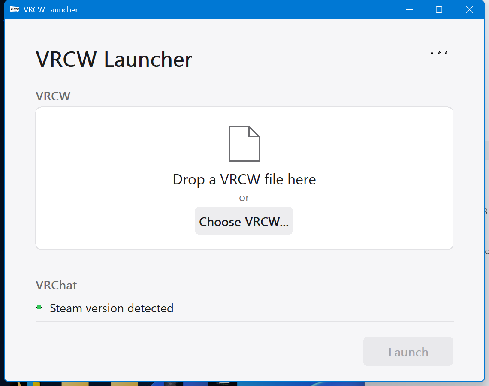

# VRCW Launcher

A tiny native Windows launcher that starts VRChat straight into a `.vrcw` world file.

Built with C++ and the Win32 API only: no Electron, no Qt, no Python, no .NET runtime.
It is a single self-contained executable of around 360 KB.

## Files and registry

The launcher keeps everything in one place and never needs administrator rights.

| What | Where | When |
| --- | --- | --- |
| Settings | `%APPDATA%\VRCW Launcher\settings.ini` | Created when a setting is changed, and to remember the detected VRChat path |
| `.vrcw` file association | `HKEY_CURRENT_USER\Software\Classes\.vrcw` and `HKEY_CURRENT_USER\Software\Classes\VRCWLauncher.VRCWWorld` | Only when you turn on **Associate .vrcw Files** in the settings menu |

The settings file is a plain INI file:

```ini
[General]
KeepLauncherOpen=0     ; stay open after VRChat has been started
ChineseUi=1            ; only written once you pick a language yourself

[VRChat]
ExecutablePath=F:\SteamLibrary\steamapps\common\VRChat\VRChat.exe

[Recent]
Count=2
File0=F:\Worlds\World.vrcw
File1=F:\Worlds\Another.vrcw
```

Everything else the launcher reads is read-only:

- The Steam installation and library configuration, to find VRChat
  (`HKEY_CURRENT_USER\Software\Valve\Steam`, `HKEY_LOCAL_MACHINE\SOFTWARE\...\Valve\Steam`
  and `libraryfolders.vdf`)
- The Windows appearance settings, to follow the light or dark theme and the
  system accent colour (`...\Themes\Personalize`, `HKCU\Software\Microsoft\Windows\DWM`)

The launcher does not use the network, sends no telemetry, adds no startup entry,
installs no service, and never modifies your VRChat installation or its settings.
Deleting the settings file resets the launcher to its defaults, and unticking the
file association removes the registry entries it created.

## Screenshots

| Dark appearance | Settings menu |
| --- | --- |
|  |  |

The interface follows the Windows appearance, including the light theme and the
system accent colour:

| Light appearance |
| --- |
|  |

## What it does

1. You give it a `.vrcw` file (file picker, drag and drop, drag onto the exe, or double click).
2. It finds your Steam copy of VRChat by reading the Steam library configuration.
3. It generates a random room id and starts VRChat with

   ```
   --url=create?roomId=<random>&hidden=true&name=BuildAndRun&url=file:///<world>
   --watch-worlds --watch-avatars
   ```

4. The launcher exits once VRChat is running (optional: stay open).

Nothing technical is ever shown in the interface: no paths, no command line, no room id.

## Features

- Native file picker, drag and drop with drop feedback, and a Change button
- Launch button that enables itself only when everything is ready
- Automatic Steam VRChat detection, with a manual folder pick as a fallback
- Recently used worlds, with missing files shown as unavailable
- Per-user `.vrcw` file association, no administrator rights needed
- Drag a `.vrcw` onto the executable, or double click one, to start silently
- Single instance: a second launch hands its file to the window that is open
- Follows the Windows light/dark appearance and the system accent colour
- English and Simplified Chinese, chosen from the Windows display language
  and switchable in the settings menu
- Per-Monitor DPI awareness V2, crisp text at any scaling
- Resizable window with a sensible minimum size

## Requirements

- Windows 10 or 11, x64
- The Steam version of VRChat

## Building

Open `VRCWLauncher/VRCWLauncher.slnx` with Visual Studio 2022 or 2026 and build the
x64 Release configuration. The project uses the static C runtime, so the resulting
executable has no external dependencies.

## Usage

Run `VRCWLauncher.exe`, choose or drop a `.vrcw` file and press Launch.

The settings menu (the three dots in the title row) contains:

| Item | Description |
| --- | --- |
| Keep Launcher Open | Stay open after VRChat has been started |
| Associate .vrcw Files | Register `.vrcw` for this user so double click works |
| Choose VRChat Folder | Only needed when automatic detection fails |
| Clear Recent Files | Forget the remembered worlds |
| 中文界面 | Switch the interface language |
| About | Version, project link, and the licence note |

Settings are stored in `%APPDATA%\VRCW Launcher\settings.ini`.

## Notes

- This is an unofficial fan tool. It is not affiliated with VRChat Inc.
- World loading uses the same command line the official VRChat SDK "Build and Test"
  flow uses, with a random room id, so worlds open in a private instance.

## 中文说明

一个用 C++ 和 Win32 API 写的小启动器：给它一个 `.vrcw` 世界文件，它会自动找到 Steam 版
VRChat，生成随机房间号，并用官方 SDK 的那套命令行参数启动游戏。

单文件、无依赖、约 360 KB，启动快、占用低。支持拖放、双击 `.vrcw` 直接启动、最近使用、
`.vrcw` 文件关联（当前用户，无需管理员）、深浅色跟随系统和强调色、中英文界面（跟随系统
语言，也可在菜单里切换）。

这是非官方工具，与 VRChat Inc. 没有关联。

**配置与注册表**：所有设置只写在 `%APPDATA%\VRCW Launcher\settings.ini` 一个文件里（保留启动器开关、
语言选择、VRChat 路径缓存、最近使用的世界）。注册表默认完全不动，只有在菜单里勾选
"关联 .vrcw 文件"时才会写入当前用户（`HKCU\Software\Classes`），取消勾选即删除。
程序不联网、无遥测、不写启动项、不装服务，也不会改动 VRChat 自身的设置或安装文件。

## License

MIT, see [LICENSE](LICENSE).
